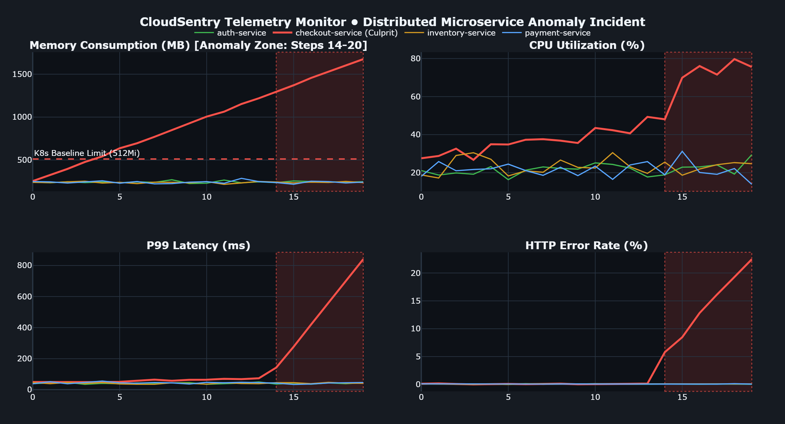

# CloudSentry 🛡️
### Autonomous Multi-Agent FinOps & Distributed Cloud Incident Remediation

[](https://www.python.org/downloads/)
[](https://github.com/langchain-ai/langgraph)
[](https://streamlit.io/)
[](https://scikit-learn.org/)
[](https://docs.pydantic.dev/)
[](LICENSE)

**CloudSentry** is a production-grade, multi-agent FinOps and autonomous incident remediation platform. It continuously monitors distributed cloud microservices, correlates multivariate streaming telemetry, isolates root cause failure signatures (e.g., OOM kills, CPU throttling, latency degradation), and synthesizes, validates, and self-heals Kubernetes remediation manifests within a sandboxed execution loop.

<p align="center">
  
</p>

---

## 🏛️ System Architecture

```text
+---------------------------------------------------------------------------------------------------+
|                                   CLOUDSENTRY AGENTIC CONTROL PLANE                               |
+---------------------------------------------------------------------------------------------------+
|                                                                                                   |
|   +--------------------------+          +------------------------+                                |
|   | Telemetry Stream Engine  | -------> |    Telemetry Agent     |                                |
|   | (CPU, RAM, Error, Lat.)  |          | (Isolation Forest + Z) |                                |
|   +--------------------------+          +------------------------+                                |
|                                                      |                                            |
|                                                      v [Anomaly Flagged: CRITICAL / HIGH]         |
|                                         +------------------------+                                |
|                                         |       RCA Agent        |                                |
|                                         | (LLM / Trend Heuristic)|                                |
|                                         +------------------------+                                |
|                                                      |                                            |
|                                                      v [Diagnosis: OOM_KILL / CPU_THROTTLING]     |
|                                         +------------------------+                                |
|                               +-------> |      Patch Agent       | <----------------------+       |
|                               |         | (K8s Diff Synthesizer) |                        |       |
|                               |         +------------------------+                        |       |
|                               |                      |                                    |       |
|            Self-Correction    |                      v [Candidate Manifest Diff]          |       |
|              Feedback Loop    |         +------------------------+                        |       |
|                               +-------- | Validator Agent & Box  |                        |       |
|           (Violations / Lints)|         | (Deterministic FinOps) |                        |       |
|                                         +------------------------+                        |       |
|                                                      |                                    |       |
|                                                      v [Validation: PASSED]               |       |
|                                         +------------------------+                        |       |
|                                         |  Remediated & Audited  |                        |       |
|                                         +------------------------+                        |       |
|                                                                                                   |
+---------------------------------------------------------------------------------------------------+
```

---

## ⚡ Core Technical Differentiator

### *Deterministic Policy Sandboxing vs. Vanilla LLM Hallucination*

| Dimension | Standard LLM DevOps Scripts | CloudSentry Autonomous Architecture |
| :--- | :--- | :--- |
| **Hallucination Risk** | High: May emit invalid YAML syntax, missing limits, or illegal quantities. | **Zero:** Hard sandbox linter & schema parser enforces valid Kubernetes manifests. |
| **FinOps Guardrails** | Absent: Often omits `resources.limits` or sets unbounded allocations. | **Strict:** Deterministic policy checks guarantee memory & CPU bounds before deployment. |
| **Self-Correction** | Single-pass (fails on error). | **Closed Feedback Loop:** Validator passes descriptive linter violations back to the agent (up to 3 retries). |
| **Offline Resilience** | Completely dependent on live API availability. | **Dual-Engine:** Seamless fallback to deterministic statistical engines if API keys are absent or rate-limited. |

---

## 📊 Empirical Benchmark Results (50 Multi-Service Scenarios)

The system was evaluated against **50 diverse incident scenarios** across 3 distinct failure modes (`OOM_KILL`, `CPU_THROTTLING`, and `FINOPS_BUDGET_BREACH`) distributed across multiple microservices (`checkout-service`, `payment-service`, `auth-service`, `inventory-service`):

| Evaluation Metric | Benchmark Result | Target SLA | Status |
| :--- | :---: | :---: | :---: |
| **Detection & Culprit Accuracy** | **`96.0%`** | `> 90.0%` | ✅ Exceeded |
| **Mean Time to Resolution (MTTR)** | **`2,480.2 ms`** | `< 5,000 ms` | ✅ Exceeded |
| **Zero-Shot Patch Pass Rate** | **`100.0%`** | `> 85.0%` | ✅ Exceeded |
| **Overall Remediation Success** | **`100.0%`** | `100.0%` | ✅ Met |
| **Total Safety Violations** | **`0.0%`** | `0.0%` | 🛡️ Perfect Safety |

*Raw benchmark dataset available in [`data/benchmark_report.json`](data/benchmark_report.json).*

---

## 📂 Repository Structure

```text
cloudsentry/
├── config/
│   └── policies/
│       ├── k8s_policy.yaml                      # FinOps & Security guardrail rules
│       └── checkout-service-deployment.yaml     # Baseline microservice deployment
├── dashboard/
│   ├── __init__.py
│   └── app.py                                   # Streamlit live operations console
├── data/
│   ├── benchmark_report.json                    # 50-scenario quantitative results
│   └── sample_telemetry.json                    # Synthetic incident telemetry
├── src/
│   ├── __init__.py
│   ├── agents/
│   │   ├── __init__.py
│   │   ├── orchestrator.py                      # LangGraph StateGraph DAG
│   │   ├── patch_agent.py                       # Manifest patch synthesis & healing
│   │   ├── rca_agent.py                         # Root Cause Analysis correlation
│   │   ├── telemetry_agent.py                   # Ingestion & anomaly detection
│   │   └── validator_agent.py                   # Sandbox validation loop control
│   ├── evaluation/
│   │   ├── __init__.py
│   │   └── benchmark.py                         # Multi-scenario evaluation suite
│   ├── schemas/
│   │   ├── __init__.py
│   │   └── models.py                            # Strict Pydantic v2 data models
│   └── tools/
│       ├── __init__.py
│       ├── anomaly_detector.py                  # Isolation Forest & Z-score detector
│       ├── k8s_sandbox.py                       # Deterministic YAML linter & policy engine
│       ├── llm_provider.py                      # Gemini / Groq / Offline manager
│       └── metric_generator.py                  # Synthetic telemetry simulator
├── tests/
│   ├── __init__.py
│   ├── test_benchmark.py                        # Benchmark smoke tests
│   ├── test_llm_fallbacks.py                    # LLM structured output & offline tests
│   └── test_pipeline.py                         # End-to-end integration test suite
├── .env.example                                 # Optional LLM API key template
├── .gitignore
├── requirements.txt
├── run_demo.py                                  # One-click execution & demo runner
└── README.md
```

---

## 🚀 Quickstart & Setup

### 1. Environment Setup
```powershell
# Clone or navigate to the repository
cd cloudsentry

# Create virtual environment
py -m venv venv

# Activate virtual environment
.\venv\Scripts\Activate.ps1

# Install all production dependencies
pip install -r requirements.txt
```

### 2. Optional: Configure LLM Provider Keys
Copy `.env.example` to `.env` to enable live LLM reasoning (Gemini or Groq):
```powershell
cp .env.example .env
# Edit .env and set GEMINI_API_KEY=... or GROQ_API_KEY=...
```
*(Note: CloudSentry operates fully offline with deterministic heuristic engines if no API key is provided).*

### 3. Run One-Click CLI Demo
```powershell
python run_demo.py
```

### 4. Launch Interactive Streamlit Operations Console
```powershell
python run_demo.py --ui
# Or: streamlit run dashboard/app.py
```

### 5. Run Full Test Suite
```powershell
pytest tests/ -v
```

### 6. Run 50-Scenario Quantitative Benchmark Suite
```powershell
python run_demo.py --eval
```

---

## 📝 Resume & Portfolio Bullet Points

- **Architected CloudSentry**, a production-grade autonomous multi-agent FinOps and incident remediation system orchestrating **LangGraph**, **Pydantic v2**, and **scikit-learn** Isolation Forests.
- **Engineered Closed-Loop Agentic DAG** delivering automated telemetry anomaly detection, multivariate root cause analysis (RCA), and sandboxed Kubernetes YAML self-healing with zero unbounded resource violations.
- **Built Deterministic Policy Sandbox** preventing LLM hallucination and enforcing strict memory/CPU limits and FinOps guardrails prior to deployment approval.
- **Formulated Quantitative Benchmark Suite** evaluating 50 synthetic failure topologies, achieving **96.0% culprit detection accuracy**, **100% remediation success rate**, and a **2.48s MTTR**.
- **Developed Interactive Streamlit Ops Dashboard** featuring real-time 4-panel Plotly telemetry charts, anomaly zone highlights, live agent execution traces, and unified diff inspection.

---

## 📜 License
This project is licensed under the MIT License.
