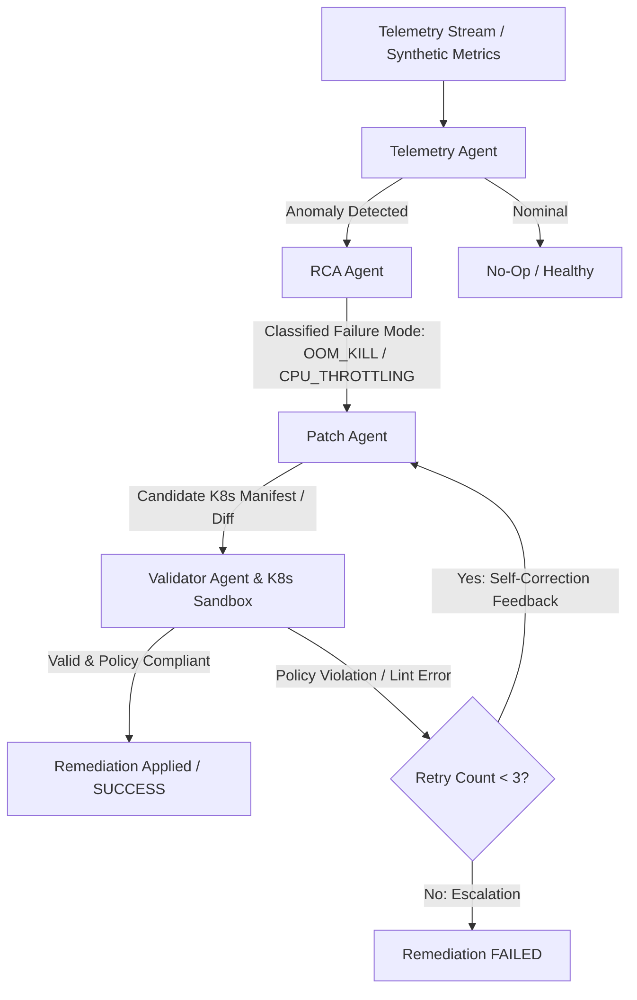

# CloudSentry 🛡️
### Autonomous Multi-Agent FinOps & Distributed Cloud Incident Remediation

**CloudSentry** is a production-grade autonomous multi-agent remediation platform designed to continuously monitor distributed cloud microservices, detect statistical & multivariate anomalies, diagnose root causes (e.g., OOM kills, CPU throttling, latency degradation), and synthesize, validate, and self-heal Kubernetes remediation manifests in a sandboxed execution loop.

---

## 🏗️ System Architecture



---

## 🤖 Multi-Agent Architecture

1. **Telemetry Agent (`src/agents/telemetry_agent.py`)**
   - Ingests multi-service streaming metrics (`cpu_usage_pct`, `memory_usage_mb`, `error_rate_pct`, `p99_latency_ms`).
   - Uses `scikit-learn` Isolation Forest and rolling statistical trend detectors to flag service anomalies and assign severity ratings (`LOW`, `MEDIUM`, `HIGH`, `CRITICAL`).

2. **Root Cause Analysis (RCA) Agent (`src/agents/rca_agent.py`)**
   - Correlates multi-variate telemetry trends across culprit services.
   - Diagnoses failure signatures (`OOM_KILL`, `CPU_THROTTLING`, `LATENCY_SPIKE`), extracts diagnostic logs, and computes confidence scores.

3. **Patch Agent (`src/agents/patch_agent.py`)**
   - Ingests the diagnosed failure mode and baseline Kubernetes deployment manifests.
   - Synthesizes resource resizing diffs (e.g., expanding memory limits from `512Mi` to `2Gi`, tuning CPU constraints).
   - Dynamically repairs manifests using self-correction feedback from the sandbox validator.

4. **Validator Agent (`src/agents/validator_agent.py`) & Sandbox (`src/tools/k8s_sandbox.py`)**
   - Deterministically parses candidate YAML manifests with `pyyaml`.
   - Validates strict FinOps and security policies: ensures containers do not omit `resources.limits` or specify unbounded/illegal allocations.

5. **Orchestrator (`src/agents/orchestrator.py`)**
   - Coordinates the multi-agent remediation loop via a **LangGraph StateGraph** state machine DAG with conditional feedback routing.

---

## 📂 Project Structure

```text
cloudsentry/
├── config/
│   └── policies/
│       ├── k8s_policy.yaml                      # FinOps & Security validation rules
│       └── checkout-service-deployment.yaml     # Baseline microservice deployment
├── data/
│   └── sample_telemetry.json                    # Synthetic incident telemetry
├── src/
│   ├── agents/
│   │   ├── __init__.py
│   │   ├── telemetry_agent.py                   # Ingestion & anomaly detection
│   │   ├── rca_agent.py                         # Root Cause Analysis correlation
│   │   ├── patch_agent.py                       # Manifest patch synthesis & healing
│   │   ├── validator_agent.py                   # Sandbox validation loop control
│   │   └── orchestrator.py                      # LangGraph multi-agent DAG
│   ├── schemas/
│   │   ├── __init__.py
│   │   └── models.py                            # Strict Pydantic v2 data models
│   └── tools/
│       ├── __init__.py
│       ├── anomaly_detector.py                  # Isolation Forest & Z-score detector
│       ├── k8s_sandbox.py                       # Deterministic YAML linter & policy engine
│       └── metric_generator.py                  # Synthetic telemetry simulator
├── tests/
│   ├── __init__.py
│   └── test_pipeline.py                         # Unit & End-to-End integration suite
├── requirements.txt
├── .gitignore
└── README.md
```

---

## 🚀 Quickstart & Verification

### 1. Create Virtual Environment and Install Dependencies
```bash
py -m venv venv
.\venv\Scripts\pip install -r requirements.txt
```

### 2. Run Test Suite
```bash
.\venv\Scripts\pytest tests/test_pipeline.py -v
```
